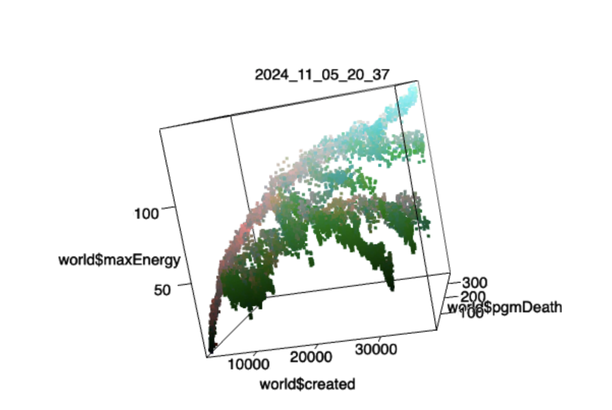

# Lana Sinapayen

[Publications](https://scholar.google.com/citations?hl=fr&user=UVvjeaoAAAAJ&view_op=list_works&sortby=pubdate)

[Bluesky](https://bsky.app/)

[Mastodon](https://elk.zone/mastodon.social/@lana_sina)

## About

Artficial Life - Astrobiology

These days I am especially interested in replicating evolution (of biological or cultural systems) and looking for life in the universe. I am on the Executive board of [Kyoto International School](https://www.kis.ac.jp/). [My dog talks](https://www.instagram.com/iikocookie/).

#Astrobiology #OpenEndedEvolution #CellularAutomata #OpenCollaboration

## What am I working on?

### Agnostic biosignatures: looking for life in the universe

How do we look for life in the universe when we don't know what that life will look like? One approach is to focus on what life does rather than what it is made of. I work on measures of complexity and measures of "life". 

- How could you detect life on faraway planets? [Assessing planetary complexity and potential agnostic biosignatures using epsilon machines](https://www.nature.com/articles/s41550-021-01559-x) (arxiv: https://arxiv.org/abs/2202.03699)? 
- Life replicates, mutates, and leaves unique correlations behind. We propose a way to detect those at the galactic level: [An Agnostic Biosignature Based on Modeling Panspermia and Terraformation](https://arxiv.org/abs/2403.14195)  
- What kind of data and how much of it do you need to make a reasonable assumption about whether a system is alive or not? [Fake Life Recognition Contest](https://github.com/LanaSina/FLR_contest)

  

### Self-replication and Exponential Mutation in Neural Cellular Automata

Cellular automata are these litte programs that look like moving patterns on a grid. Recently, several advances have brought those automata from the famous black and white grids to full on interactive, sometimes continuous graphics.
I [wrote](https://www.qeios.com/read/JPUWVB) about making the patterns self-replicate and trying to make them gain more diverse mutations.

### Open Ended Speciation (unpublished)

What are the conditions for one species to branch into 2, 5, 10 descending species? I research the parameters leading to speciation in simulated worlds.

[Videos](https://www.youtube.com/watch?v=ayot-ddhrmk&list=PLYuu1RcSnrYTBTx-F3edZLo45vnBVyIFR)

### Artificial Perception
I research [visual illusions in neural networks](https://github.com/LanaSina/evolutionary_illusion_generator), biological and artificial, on the principle that systems that "fail" as the brain does teach us more than systems that superficially succeed as humans do. I am not so much interested in perfect artificial vision as I am interested in charmingly and accurately faulty artficial perception.

Motion illusions produced by my evolutionary generator:

 

## Who am I?

I am a French researcher living in Kyoto with [my dog](https://www.instagram.com/iikocookie/).
I research the principles of the evoluton of life, learning, predictive systems, and [Artificial Perception](https://sites.google.com/view/artificialperception/home).

I am an associate researcher (and founding member) of Sony Computer Science Labs' [Kyoto Lab](https://www.sonycsl.co.jp/kyoto/) and an associate professor at the [National Institute for Basic Biology](http://www.nibb.ac.jp/en/) in Japan.
I am also the Research Chair of the [International Society for ALife's](http://www.alife.org/about-isal) board of directors, a member of ISAL's DEI committee.

You can read about my career path on my [CV (2023)](lana_cv.pdf) (tl;dr: I went to Engineering School in France then moved to Japan where I got my Master's and PhD. I used to speak ~9 languages and can do just about anything that involves programming. Sometimes I get awards for scientific work or non scientific work. My favorite scientist is [Frans De Waal](https://en.wikipedia.org/wiki/Frans_de_Waal). I like food.)

## Follow me

Fnd me on [Bluesky](https://bsky.app/) or [Mastodon](https://elk.zone/mastodon.social/@lana_sina).
Keep up with the ALife community through the [newsletter](https://alife-newsletter.github.io/Newsletter/).

## Read me 

Learn about Artificial Life in my [Introduction to Artificial Life for People who Like AI](https://thegradient.pub/an-introduction-to-artificial-life-for-people-who-like-ai/) on The Gradient.

I used to write about my ideas and curate exciting science on [Medium](https://medium.com/@sina_lana)

This [very old blog](https://itakoyak.wordpress.com/) has scientific ideas as well as more personal stories.

Most of my papers are listed in my Google Scholar [profile](https://scholar.google.co.jp/citations?hl=en&pli=1&user=UVvjeaoAAAAJ)

