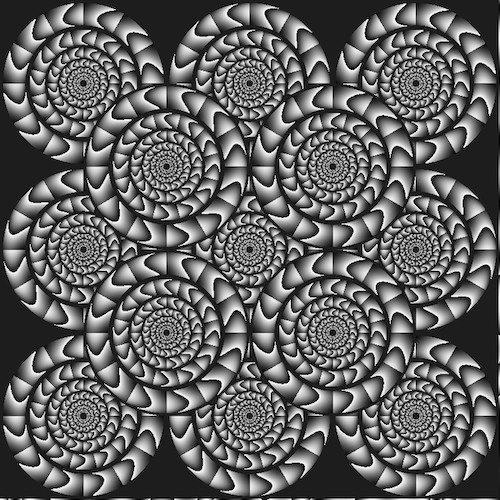
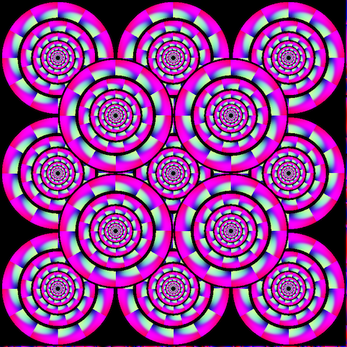

# About

## Who am I?

I am an associate researcher (and founding member) of Sony Computer Science Labs' new Kyoto Lab. Read more about my motivations for starting the lab by clicking on my picture [here](https://www.sonycsl.co.jp/kyoto/) (English and Japanese). I am also the Research Chair on the [International Society for ALife's](http://www.alife.org/about-isal) board of directors. I research learning and predictive systems, and I am interested in sanitizing science practices.
You can read about my career path on my [CV](lana_cv.pdf) (tl;dr: I went to Engineering School in France then moved to Japan where I got my Master's and PhD. I used to speak ~9 languages and can do just about anything that involves programming. Sometimes I get awards for scientific work or non scientific work. My favorite scientist is [Frans De Waal](https://en.wikipedia.org/wiki/Frans_de_Waal). I like food.)

## Follow me

Message me on Twitter [@sina_lana](https://twitter.com/sina_lana)

## Read me 

Learn about Artificial Life in my [Introduction to Artificial Life for People who Like AI](https://thegradient.pub/an-introduction-to-artificial-life-for-people-who-like-ai/) on The Gradient.

I write about my ideas and curate exciting science on [Medium](https://medium.com/@sina_lana)

This [very old blog](https://itakoyak.wordpress.com/) has scientific ideas as well as more personal stories.

Most of my papers are listed in my Google Scholar [profile](https://scholar.google.co.jp/citations?hl=en&pli=1&user=UVvjeaoAAAAJ)

## What am I working on?

I am interested in systems that learn in unconventional ways, as well as unconventional systems that learn in mainstream ways. Currently I work a lot on predictive coding. Some of my projects:

I research [visual illusions in neural networks](https://github.com/LanaSina/evolutionary_illusion_generator), biological and artificial, on the principle that systems that "fail" as the brain does teach us more than systems that superficially succeed as humans do. I am not so much interested in perfect artificial vision as I am interested in charmingly and accurately faulty artficial perception.

I also work on measures of complexity and measures of "life". How could you detect life on [faraway planets](https://agu.confex.com/agu/abscicon19/prelim.cgi/Paper/480711)? What kind of data and how much of it do you need to make a reasonable assumption about [whether a system is alive or not](https://github.com/LanaSina/FLR_contest)?

I am building a platform for [better science](https://docs.google.com/presentation/d/1V_K8hghgnvGfEtW7TdwtowTveZyy4Qs8rMemNyHx_Dg/edit?usp=sharing).

Other projects of mine include putting predictive networks in mobile phones and recording weird behavior in plants.

Motion illusions produced by my evolutionary generator.

